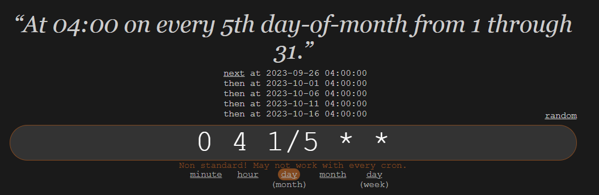
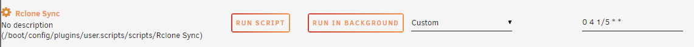
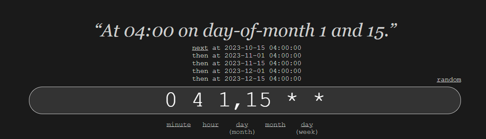
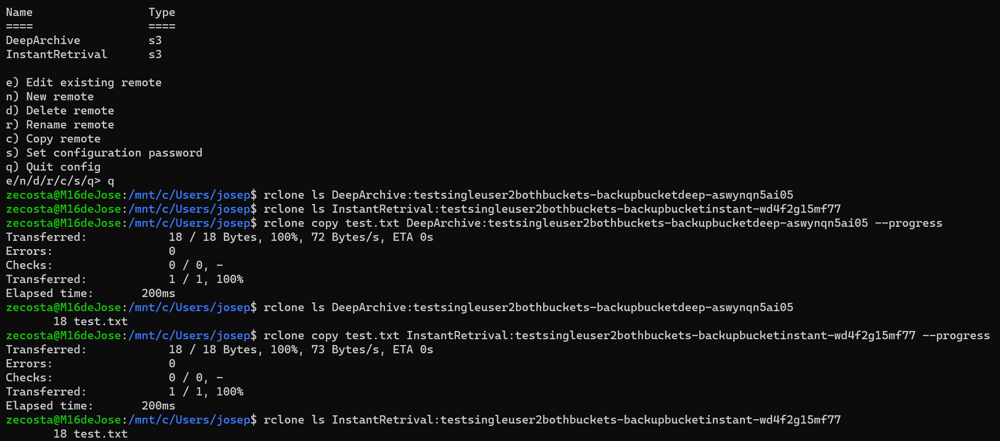

# Backup UNRAID NAS

This repository contains all the scripts and the backup plan for all the files in my UNRAID NAS.

The three main purposes of this backup are:

- Being cheap

- Functional

- Simple

### S3 Buckets

After a lot of thought I decided to use two Amazon S3 buckets.

The first one (*Knox*) is for files that in case of permanent loss on my NAS I do not need to access immediately (ex. photos, videos, ISO's, ...). These files will be on a S3 Glacier Deep Archive bucket.

The second bucket (*ClipKiller*) is for files that I need immediate access in case of total loss. This bucket will keep three versions of an object for thirty days. These files will be on a S3 Glacier Flexible Retrieval bucket.

Both buckets will abort incomplete files uploads after 2 days. In case I try to upload big files in multiple chunks and the process fails or is interrupted I wont be charged for the chunks that were uploaded.

### IAM User

I created a limited IAM user in CloudFormation with permission to upload files to both buckets.

His actions include:

- 's3:* MultipartUpload*' - Performing multipart uploads of objects to the S3 bucket.
- 's3:ListBucket' - Listing the contents of the bucket.
- 's3:GetObject' - Getting individual objects from the bucket.
- 's3:PutObject' - Putting (uploading) objects into the bucket.

## AWS CloudFormation File

In this [`AWS CloudFormation Template`](stack.yml) there are all the resources that need to be implemented in the AWS cloud. Includes both buckets that were mentioned previously and the IAM user.

## Instalation in Unraid

1. Install the Rclone and User Scripts plugins in the apps tab. Make sure you install the plugin and not the docker app.

2. Create both remotes using the `rclone config` command in the terminal. In case you want to manually edit the config file you can do it in this location: `/boot/config/plugins/rclone`. There you will find the [`rclone.conf`](.rclone.conf) file.

3. Get all the directories that you want to sync to AWS and add them in the list.

4. In the User Scripts plugin add a new script and set the cron job (Mine is `0 4 1/5 * *`).

5. In the gear next to the name click on `Edit Script` and copy the script with all the variables set up. In your encripted your rclone config you must place it in the `export RCLONE_CONFIG_PASS`.

6. Then click on `RUN SCRIPT` and watch it sync to AWS. :)

## Timeline
- 02/10/2023
  - New cron job for Knox (0 4 1,15 * *)

- 24/09/2023
  - Final deployment and README complete.

- 21/09/2023
  - Sync script completed.

- 19/09/2023
  - First test of sync a few NAS folders to the Instant Retrival bucket.
  - Password export on sync script.

- 22/08/2023
  - Test deployment using a single IAM user for both buckets.
  - Both remotes used the same access key and secret access key for the IAM user.

  

- 20/08/2023
  - Test deployment using WSL and Rclone for a single file.

  

  PS: The file was uploaded to Glacier Deep Archive as was specified configuring the remote in Rclone 🎆

- 19/08/2023
  - First scripts and planning

## Biography

- AWS Documentation

- https://betterdev.blog/personal-backup-to-amazon-s3/

- https://github.com/geerlingguy/my-backup-plan

- https://rclone.org/s3/#configuration

## Author

José Costa - Nova School of Science and Technology

josepirescosta2003@gmail.com

[Twitter](https://twitter.com/Jos3Costa)

[GitHub](https://github.com/zepedrocosta)

[LinkedIn](https://www.linkedin.com/in/jos%C3%A9-costa-595b01239/)
