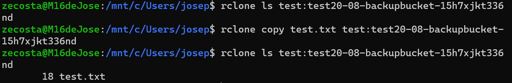

# Backup UNRAID NAS

This repository contains all the scripts and the backup plan for all the files in my UNRAID NAS.

The three main purposes of this backup are:

- Being cheap

- Functional

- Simple

### S3 Buckets

After a lot of thought I decided to use two Amazon S3 buckets.

The first one (*Knox*) is for files that in case of permanent loss on my NAS I do not need to access immediately (ex. photos, videos, ISO's, ...). These files will be on a S3 Glacier Deep Archive bucket.

The second bucket (*ClipKiller*) is for files that I need immediate access in case of total loss. This bucket will keep three versions of an object for thirty days. These files will be on a S3 Glacier Instant Retrieval bucket. This way is cheaper than standard S3 but I can still retrive the objects instantly.

Both buckets will abort incomplete files uploads after 2 days. In case I try to upload big files in multiple chunks and the process fails or is interrupted I wont be charged for the chunks that were uploaded.

### IAM User

I created a limited IAM user in CloudFormation with permission to upload files to the bucket.

His actions include:

- 's3:* MultipartUpload*' - Performing multipart uploads of objects to the S3 bucket.
- 's3:ListBucket' - Listing the contents of the bucket.
- 's3:GetObject' - Getting individual objects from the bucket.
- 's3:PutObject' - Putting (uploading) objects into the bucket.

## AWS CloudFormation File

In this [`AWS CloudFormation Template`](stack.yml) there are all the resources that need to be implemented in the AWS cloud. Includes both buckets that were mentioned previously and the IAM user.

TODO: Make sure that the IAM user can upload to both buckets,

## Biography

- AWS Documentation

- https://betterdev.blog/personal-backup-to-amazon-s3/

- https://github.com/geerlingguy/my-backup-plan/tree/master

- https://rclone.org/s3/#configuration

## Timeline

- 20/08/2023
  - Test deployment using WSL and Rclone for a single file

  

  PS: The file was uploaded to Glacier Deep Archive as was specified configuring Rclone 🎆
- 19/08/2023
  - First scripts and planning

## Autor

José Costa - Nova School of Science and Technology

josepirescosta2003@gmail.com

[Twitter](https://twitter.com/Jos3Costa)

[GitHub](https://github.com/zepedrocosta)

[LinkedIn](https://www.linkedin.com/in/jos%C3%A9-costa-595b01239/)
